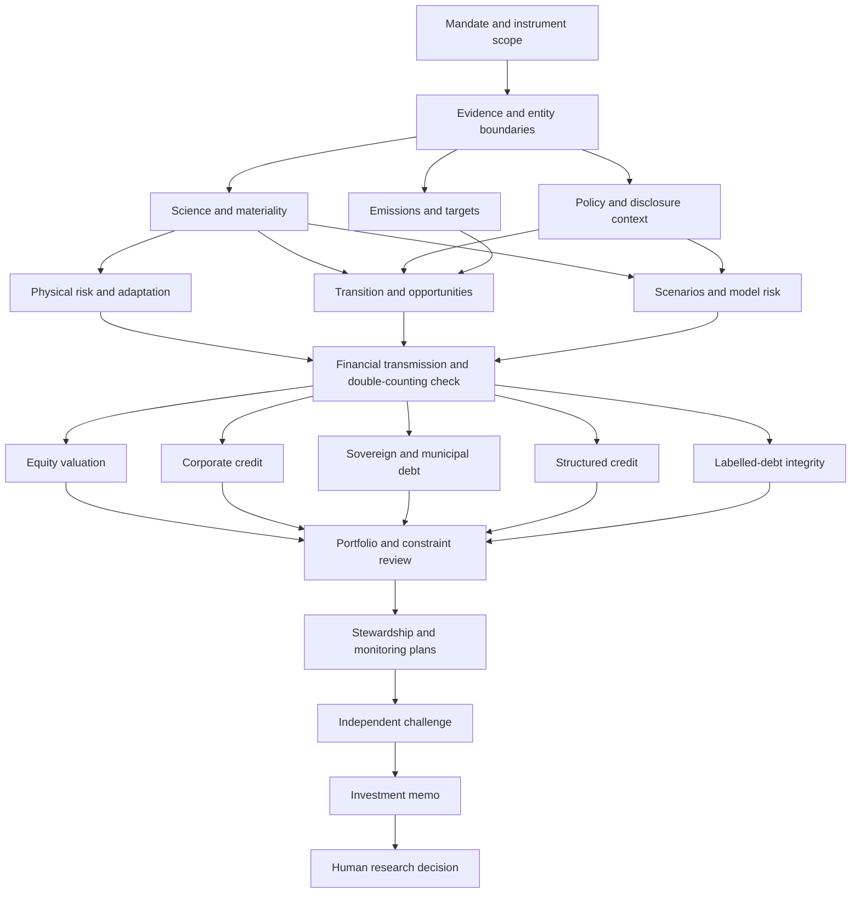

# Climate Investment AI Agent in Equity and Bond Markets

**Built for institutional-quality climate investment research—with a traceable, auditable evidence layer.**

The **Climate Investment AI Agent by HHFinAi** is a Python research workflow for institutional equity analysts, fixed-income investors, portfolio managers and investment committees. It connects climate-risk analysis to equity valuation, bond credit analysis and portfolio review while preserving evidence references, dated source records, analytical assumptions, calculation explanations, revisions and human research decisions.

**Inspect the evidence behind the conclusion—not just the generated narrative.** Institutional quality here means inspectable research-process controls. It does **not** mean independently audited, production-certified, or guaranteed investment accuracy.

Engine **0.1.0** · **20 specialist roles** · **7 instrument-aware workflows** · Python **3.10+** · Human review · No autonomous trading

[](https://github.com/HHFinAi/climate-investment-ai-agent-in-equity-and-bond-markets/actions/workflows/validate.yml)

[Evidence and audit trail](docs/EVIDENCE_AUDIT.md) · [Institutional-quality controls](docs/INSTITUTIONAL_QUALITY.md) · [FAQ](docs/FAQ.md) · [Workflow](WORKFLOW.md) · [Validation scope](docs/VALIDATION_2026-09-23.md) · [Software citation](CITATION.cff)

## What makes the evidence layer traceable and auditable?

| Investment-research requirement | Implemented control | Inspect the evidence |
|---|---|---|
| Trace findings to registered sources | Evidence IDs, source locators, entity scope, observation/retrieval dates and declared review status. | [Data contract](references/data-contract.md), [validation code](climate_agent/validation.py) |
| Separate evidence from judgment | Findings distinguish facts, inferences, assumptions, calculations and source methods; calculations require a stated basis. | [Output schema](schemas/agent-output.schema.json), [validation tests](tests/test_validation.py) |
| Reconstruct the analytical context | Run inputs, selected roles, instructions and methodology map are frozen with a SHA-256 digest. | [State engine](climate_agent/workflow.py), [audit walkthrough](docs/EVIDENCE_AUDIT.md) |
| Avoid relying on superseded analysis | Revisions archive prior artifacts, invalidate affected downstream work and clear prior review. | [Workflow tests](tests/test_workflow.py) |
| Expose material missing information | `NEEDS_DATA` and `BLOCKED` stop dependent work; declared unresolved material/critical review issues block approval. | [Claim-to-control matrix](docs/INSTITUTIONAL_QUALITY.md) |
| Record accountable research decisions | Human-review attestation, rationale and packet digest; no research approval for demo/source-study runs. | [Review implementation](climate_agent/workflow.py) |

**Auditable means reviewable local research records—not tamper-proof recordkeeping.** Evidence-review flags are analyst/host attestations. The engine does not authenticate reviewer identity, independently verify source truth, archive every linked source document, or prove that a citation supports the associated prose. [Read the control boundaries](docs/EVIDENCE_AUDIT.md#control-boundaries).

## Who is this agent for?

**Equity research teams** can organize physical/transition risk, competitive economics, climate-adjusted cash-flow assumptions, scenario sensitivities and per-share valuation. **Bond and credit teams** receive instrument-specific handoffs covering obligor and guarantor, repayment, maturity, refinancing, seniority, collateral, rates/spreads and recovery. **Portfolio managers and investment committees** can inspect exposures, assumptions, missing data and challenge findings before recording a research decision.

A labelled green, transition or sustainability-linked bond receives an additional label-integrity review—not an exemption from credit analysis. The supported routes also distinguish sovereign, municipal and structured credit. These are intended research use cases, not claims of client adoption or a complete production risk platform.

## What runs, and what does not

The executable engine validates a research request, selects the correct instrument branches, emits agent work packets, validates structured results, blocks out-of-order handoffs, tracks revisions, invalidates dependent work, and produces a review packet. An external host AI agent or human performs the research using the included role instructions and actual available data tools.

There is **no embedded LLM, broker connection, live climate/market feed, scheduler or automatic trade execution**. `demo` runs deterministic synthetic fixtures to exercise the workflow; it is not a live investment-analysis run. Software tests are not evidence of alpha, scientific calibration, source entailment or regulatory compliance.

## Climate risk to equity valuation and bond credit analysis

The source's Figure 7.12 (PDF page 546, chapter 7 printed page 50) connects scenario pathways, economic shocks, issuer/asset value streams and financial impacts. This package operationalises that sequence with explicit intake and review controls.



Equity and bond outputs remain separate: equity work focuses on cash flows, capital allocation, valuation and dilution; credit work additionally focuses on obligor/guarantor, repayment, security, maturity, refinancing, rates/spreads and recovery. Labelled bonds receive **both credit analysis and label/impact analysis**. Corporate carbon intensity is not mixed with sovereign GDP-based intensity.

## Run the local tests and synthetic demo

From this folder, with Python **3.10 or later**:

```bash
python3 -m unittest discover -s tests -v
python3 scripts/check_repository.py
python3 -m climate_agent demo --workflow multi-asset --out runs/demo-01
python3 -m climate_agent status --run runs/demo-01
python3 -m climate_agent report --run runs/demo-01 > runs/demo-01/review-packet.md
```

Choose a new output directory for each run; existing directories are never overwritten. No packages, API keys or network access are required for the tests and synthetic demo. On systems whose Python executable is named `python`, substitute that command.

## Run an actual research workflow

Start from `examples/research-request-template.json`, replace the clearly marked placeholders, adopt or change the example freshness policy, and register permitted issuer, market, scenario and instrument evidence. Do not leave placeholder identity or mandate terms unresolved.

```bash
python3 -m climate_agent plan --workflow equity --input your-request.json --out runs/issuer-01
python3 -m climate_agent next --run runs/issuer-01
# The host AI/human reads the packet, performs research, and saves an artifact.
python3 -m climate_agent submit --run runs/issuer-01 --agent mandate --artifact mandate-result.json --revision 0
python3 -m climate_agent next --run runs/issuer-01
```

Repeat for the ready agents; use the latest revision from `next` or `status`. Consult `examples/mandate-artifact.json` for the JSON format, but copy `run_id` and `input_digest` from your actual work packet rather than the example. A role with a material gap returns `NEEDS_DATA`, not invented values. The detailed host procedure and evidence rules are in `AGENTS.md` and `references/data-contract.md`.

Once all work is complete and independent material exceptions are resolved, a **human** may record a research decision:

```bash
python3 -m climate_agent review --run runs/issuer-01 --reviewer "Your name" --decision APPROVE_RESEARCH --rationale "Describe the checks actually performed" --attest-human-review --revision 15
```

The revision above is illustrative; replace it with the run's current value. The tool records an attestation, not authenticated identity or trade authority. Demo/source-study runs cannot be approved as investment research.

## Choose the right route

| Workflow | Instrument scope | Additional branch |
|---|---|---|
| `equity` | Listed equities, including listed real-asset businesses | Equity strategy and valuation |
| `corporate-bond` | Unlabelled corporate debt | Corporate credit and price stress |
| `sovereign-bond` | Unlabelled sovereign debt | Fiscal/external, currency and rate/credit analysis |
| `municipal-bond` | Unlabelled municipal/sub-sovereign debt | Geographic tax/revenue and recourse analysis |
| `labelled-bond` | Labelled corporate, sovereign or municipal bonds | Underlying credit branch **plus** label review |
| `structured-credit` | Unlabelled structured credit | Collateral/waterfall diligence; specialist pricing required |
| `multi-asset` | Any supported mixture, including labelled structured debt | Only applicable branches are enabled |

## Repository guide

`WORKFLOW.md` describes the operational sequence. `agents/` holds source-linked role contracts; `workflows/` contains directed dependencies; `climate_agent/` contains the runnable engine and calculation helpers; `schemas/` describes handoff envelopes; `references/` explains source provenance and model limits; `templates/` contains analyst output structures; `examples/` contains fictional inputs and a worked arithmetic illustration; `tests/` and `.github/workflows/` contain quality checks.

Use `SKILL.md` plus the complete adjacent folder contents in a filesystem-enabled agent host. Do not copy only the entry-point file and lose its dependencies. Automatic installation/activation depends on the host and has not been certified for any specific product. In text-only environments the prompts can be applied manually, but no Python state or test gate is then enforced.

## Publishing and local synchronization

This repository is already published. In GitHub Desktop, use **Fetch origin** and **Pull origin** to synchronize remote changes before editing your local copy. The [Desktop guide](START_HERE_GITHUB_DESKTOP.md) documents initial publication; its private-publishing option is a choice for new copies, not a description of this public repository.

Preserve the local `.git/` directory. Include the supplied `.github/`, `.gitignore` and `.gitattributes` files; they may be hidden by your file manager. Do not upload the ZIP or the source CFA PDF. The guide also covers importing into an already-created remote without replacing its history.

The script `scripts/publish_github.py` is a separate, optional **initial-creation CLI route**. It is not used in the Desktop workflow and refuses an existing remote. See [PUBLISHING.md](PUBLISHING.md) for that alternative and recovery limits.

## Source and limitations

The methodological foundation is the user-supplied **897-page CFA UK climate-investing curriculum**. Original workflow engineering, calculations, validation rules and synthetic examples are separately identified as implementation extensions. Neither the source nor the software supplies independent audit certification.


See `references/SOURCE_MAP.md` for the ten-chapter map, reviewed operational anchors and one-indexed PDF page convention. The source includes historical policies, standards and market examples; these are not current verification. Quantitative helpers use supplied assumptions and do not turn emissions into default probabilities or precise physical losses.

See `VALIDATION.md` for checks actually run and checks not performed. The source PDF and page images are excluded. There is no CFA UK/CFA Institute affiliation or endorsement. Original project code and documentation are distributed under the existing [MIT license](LICENSE). The source curriculum retains its own rights and is not included; see [NOTICE.md](NOTICE.md).
